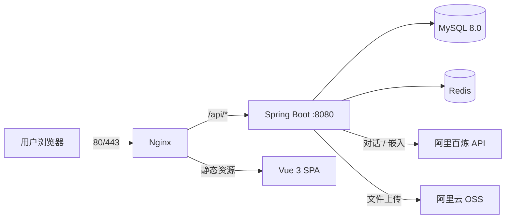

# 🎨 Xinki Portfolio

> 水墨画风的个人综合主页 — 作品展示、AI 智能助手、管理后台，开箱即用。

   

---

## ✨ 它能做什么

- **🏠 个人主页** — 水墨画风首页，展示作品集、技能、时间线、联系方式
- **🤖 AI 助手** — 全局悬浮聊天窗口，基于你的知识库智能问答，支持流式 SSE 逐字输出
- **🧠 RAG 知识库** — 上传 PDF / Markdown / TXT 自动分块向量化，AI 回复时语义检索你的资料
- **✍️ AI 内容生成** — 上传项目文档，AI 自动生成作品简介和 HTML 详细描述
- **📋 管理后台** — 可视化 CRUD 管理作品、技能、经历；AI 文档分析助手一键提取项目信息
- **🐳 Docker 部署** — MySQL + Redis + Spring Boot + Nginx，一条命令 `./deploy.sh` 上线

---

## 🏗️ 技术架构



| 层级 | 技术 |
|------|------|
| 后端 | Spring Boot 2.7 + MyBatis-Plus 3.5 |
| 前端 | Vue 3 + Vite + TypeScript + Pinia |
| AI | 阿里百炼 DashScope（对话 + text-embedding-v3） |
| 存储 | MySQL 8.0 + Redis + 阿里云 OSS |
| 部署 | Docker Compose（Nginx + 后端 + MySQL + Redis） |

---

## 🚀 部署指南

### 方式一：Docker 一键部署（推荐）

```bash
# 1. 上传项目到服务器
scp -r Xinki-Portfolio/ root@<你的ECS公网IP>:/opt/

# 2. 配置环境变量
cd /opt/Xinki-Portfolio
cp .env.example .env
vim .env

# 3. 一键部署
chmod +x deploy.sh
./deploy.sh

# 4. 验证
curl http://localhost/api/home
```

部署文件说明：

| 文件 | 用途 |
|------|------|
| `docker-compose.yml` | 4 服务编排：MySQL + Redis + 后端 + Nginx |
| `Dockerfile.backend` | Maven 多阶段构建 → JRE 17 Alpine 镜像 |
| `Dockerfile.nginx` | Node 18 构建前端 → Nginx Alpine 静态服务 |
| `deploy.sh` | 一键：安装 Docker → 拉镜像 → 构建 → 启动 |
| `.env.example` | 环境变量模板 |

需要配置的 `.env` 变量：

| 变量 | 说明 |
|------|------|
| `MYSQL_ROOT_PASSWORD` | MySQL root 密码 |
| `BAILIAN_API_KEY` | 阿里百炼 API Key（[免费申请](https://dashscope.console.aliyun.com/)） |
| `JWT_SECRET` | JWT 签名密钥（≥32 位随机字符串） |
| `OSS_ACCESS_KEY_ID` | 阿里云 OSS AccessKey |
| `OSS_ACCESS_KEY_SECRET` | 阿里云 OSS SecretKey |
| `OSS_BUCKET_NAME` | OSS Bucket 名称 |
| `OSS_ENDPOINT` | OSS Endpoint（如 oss-cn-beijing.aliyuncs.com） |

ECS 安全组需放行：**80**、**443** 端口。

#### SSL 证书（可选）

1. 阿里云 SSL 控制台申请免费证书（需域名备案）
2. 下载 Nginx 格式（`.pem` + `.key`）放到 `deploy/nginx/ssl/`
3. 修改 `deploy/nginx/nginx.conf` 中的 `server_name`
4. `docker compose up -d --build nginx`

### 方式二：本地开发

**前提**：JDK 17+、Node 18+、MySQL 8.0、Redis

```bash
# 1. 创建数据库并执行建表脚本
mysql -u root -p -e "CREATE DATABASE xinki_portfolio CHARACTER SET utf8mb4;"
mysql -u root -p xinki_portfolio < portfolio-backend/src/main/resources/db/schema.sql

# 2. 配置 application.yml（数据库密码 + 百炼 API Key）
# 3. 设置 OSS 环境变量
export OSS_ACCESS_KEY_ID="你的Key"
export OSS_ACCESS_KEY_SECRET="你的Secret"
export OSS_BUCKET_NAME="你的Bucket"

# 4. 启动后端
cd portfolio-backend && mvn spring-boot:run

# 5. 启动前端
cd portfolio-frontend && npm install && npm run dev
```

前端 `http://localhost:5173`，`/api` 自动代理到后端 `http://localhost:8080`。

> 默认管理员：`admin` / `admin123`

---

## 📡 主要接口

统一响应：`{ code: Integer, message: String, data: Object }`

| 方法 | 路径 | 说明 |
|------|------|------|
| GET | `/api/home` | 首页数据 |
| GET | `/api/projects` | 作品列表 |
| GET | `/api/projects/{id}` | 作品详情 |
| GET | `/api/about` | 关于我 |
| POST | `/api/contact` | 提交留言 |
| POST | `/api/ai/chat/stream` | AI 对话（流式 SSE） |
| POST | `/api/ai/chat/generate-content` | AI 生成作品内容 |
| POST | `/api/admin/knowledge/import` | 导入知识库文件 |
| CRUD | `/api/admin/*` | 管理后台增删改查 |
| POST | `/api/upload` | 图片上传到 OSS |

---

## 🧠 RAG 知识库

```
用户提问 → 向量化 (text-embedding-v3) → Redis 语义检索 Top-K
→ 拼接相关文本注入 system prompt → 大模型回复
```

- 支持上传 PDF / Markdown / TXT，自动分块向量化
- 文件 SHA-256 去重，重复上传自动覆盖
- 管理后台 CRUD 作品/技能/经历时自动同步索引
- Redis 不可用时自动降级内存缓存，不影响核心功能

---

## 📁 项目结构

```
Xinki-Portfolio/
├── portfolio-backend/           # Spring Boot 后端
│   └── src/main/
│       ├── java/.../controller/ # REST 控制器
│       ├── java/.../service/    # 业务逻辑（AI / RAG / OSS）
│       └── resources/db/        # 建表脚本
├── portfolio-frontend/          # Vue 3 前端
│   └── src/
│       ├── views/               # 页面 + 管理后台
│       ├── components/          # 公共组件（AI 气泡等）
│       └── styles/              # 水墨主题样式
├── deploy/                      # Docker 部署配置
├── docker-compose.yml
├── deploy.sh
└── .env.example
```

---

## 🎨 设计风格

- **水墨主题**：CSS 变量 `--ink-*` 前缀，宣纸白底色，印章红 `#c43a31`
- **字体**：衬线 Noto Serif SC / 无衬线 Noto Sans SC
- **动画**：水墨晕染、淡入淡出等东方美学特效

---

## 📄 License

MIT