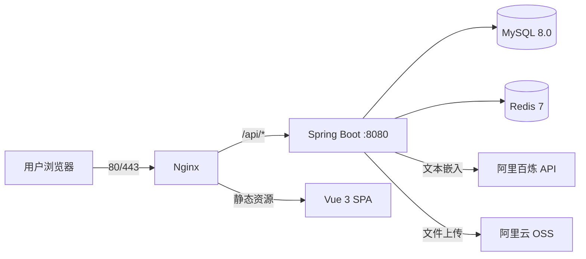

# 🎨 Xinki Portfolio

> 水墨画风的个人综合主页 — 作品展示、AI 智能助手、管理后台，开箱即用。

   

---

## ✨ 它能做什么

- **🏠 个人主页** — 水墨画风首页，展示作品集、技能、时间线、联系方式
- **🤖 AI 助手** — 全局悬浮聊天窗口，基于你的知识库智能问答（流式 SSE 逐字输出）
- **🧠 RAG 知识库** — 上传 PDF/Markdown/TXT 自动分块向量化，对话时语义检索+注入上下文
- **✍️ AI 内容生成** — 上传项目文档，AI 自动写作品简介和 HTML 详细描述
- **📋 管理后台** — 可视化 CRUD 管理作品、技能、经历，AI 文档分析助手一键提取项目信息
- **🐳 Docker 一键部署** — MySQL + Redis + Spring Boot + Nginx，`./deploy.sh` 搞定

---

## 🏗️ 技术架构



| 层级 | 技术选型 |
|------|----------|
| 后端框架 | Spring Boot 2.7.18 + MyBatis-Plus 3.5.5 |
| 前端框架 | Vue 3 + Vite + TypeScript + Pinia + Vue Router 4 |
| AI 能力 | 阿里百炼 DashScope（对话 + 文本嵌入 text-embedding-v3） |
| 数据存储 | MySQL 8.0 + Redis 7（向量缓存） |
| 文件存储 | 阿里云 OSS |
| 安全认证 | JWT + BCrypt 密码加密 |
| 部署方式 | Docker Compose 一键编排 |

---

## 🚀 快速开始（本地开发）

### 前提条件

- JDK 17+
- Node.js 18+
- MySQL 8.0（运行中）
- Redis 7（运行中，`localhost:6379`，无密码）
- 阿里百炼 API Key（[免费申请](https://dashscope.console.aliyun.com/)）
- 阿里云 OSS Bucket（存储图片文件）

### 第一步：创建数据库

```sql
CREATE DATABASE xinki_portfolio CHARACTER SET utf8mb4 COLLATE utf8mb4_unicode_ci;
```

然后执行建表脚本：

```bash
mysql -u root -p xinki_portfolio < portfolio-backend/src/main/resources/db/schema.sql
```

### 第二步：配置环境变量

```powershell
# 阿里云 OSS（必需）
$env:OSS_ACCESS_KEY_ID = "你的AccessKey"
$env:OSS_ACCESS_KEY_SECRET = "你的SecretKey"
$env:OSS_BUCKET_NAME = "你的Bucket名称"
$env:OSS_ENDPOINT = "oss-cn-beijing.aliyuncs.com"   # 可选，默认杭州
```

### 第三步：配置并启动后端

编辑 `portfolio-backend/src/main/resources/application.yml`：

```yaml
spring:
  datasource:
    password: 你的MySQL密码
bailian:
  api-key: 你的百炼APIKey
```

启动后端：

```bash
cd portfolio-backend
mvn spring-boot:run
# ✅ 启动成功 → http://localhost:8080
```

### 第四步：启动前端

```bash
cd portfolio-frontend
npm install
npm run dev
# ✅ 启动成功 → http://localhost:5173
```

前端已配置 Vite proxy，`/api` 请求自动转发到 `http://localhost:8080`。

> 默认管理员账号：`admin` / `admin123`（生产环境务必修改密码）

---

## 🐳 Docker 一键部署

适合部署到阿里云 ECS 等服务器，MySQL + Redis + 后端 + Nginx 一条命令全搞定。

### 部署步骤

```bash
# 1. 上传项目到服务器
scp -r Xinki-Portfolio/ root@<你的ECS公网IP>:/opt/

# 2. 配置环境变量
cd /opt/Xinki-Portfolio
cp .env.example .env
vim .env    # 填入 API Key、OSS 凭据等（见下方环境变量表）

# 3. 一键部署
chmod +x deploy.sh
./deploy.sh

# 4. 访问
curl http://localhost/api/home
```

### 环境变量一览

| 变量 | 说明 | 必需 |
|------|------|:---:|
| `MYSQL_ROOT_PASSWORD` | MySQL root 密码 | ✅ |
| `BAILIAN_API_KEY` | 阿里百炼 API Key | ✅ |
| `JWT_SECRET` | JWT 签名密钥（≥32位随机字符串） | ✅ |
| `OSS_ACCESS_KEY_ID` | 阿里云 OSS AccessKey | ✅ |
| `OSS_ACCESS_KEY_SECRET` | 阿里云 OSS SecretKey | ✅ |
| `OSS_BUCKET_NAME` | OSS Bucket 名称 | ✅ |
| `OSS_ENDPOINT` | OSS Endpoint（如 oss-cn-beijing.aliyuncs.com） | ✅ |
| `REDIS_PASSWORD` | Redis 密码（默认空） | ❌ |
| `DOMAIN` | 网站域名 | ❌ |

### SSL 证书（可选）

1. 阿里云 SSL 证书控制台申请免费证书（需域名备案）
2. 下载 Nginx 格式，得到 `.pem` 和 `.key`
3. 放到 `deploy/nginx/ssl/` 下，修改 `deploy/nginx/nginx.conf` 中的 `server_name`
4. 重建 Nginx：`docker compose up -d --build nginx`

### ECS 安全组

在阿里云控制台 → 安全组 → 入方向放行：**80**、**443**、**22** 端口。

---

## 📡 API 概览

> 统一响应格式：`{ code: Integer, message: String, data: Object }`

### 公开接口

| 方法 | 路径 | 说明 |
|------|------|------|
| GET | `/api/home` | 首页聚合数据 |
| GET | `/api/projects` | 作品列表 |
| GET | `/api/projects/{id}` | 作品详情 |
| GET | `/api/about` | 关于我 |
| POST | `/api/contact` | 提交留言 |

### AI 接口

| 方法 | 路径 | 说明 |
|------|------|------|
| POST | `/api/ai/chat` | AI 对话（非流式） |
| POST | `/api/ai/chat/stream` | AI 对话（流式 SSE，逐字输出） |
| GET | `/api/ai/chat/{sessionId}` | 获取对话历史 |
| DELETE | `/api/ai/chat/{sessionId}` | 清除对话历史 |
| POST | `/api/ai/chat/generate-content` | 上传文档，AI 生成作品简介+HTML描述 |

### 管理后台（需 JWT）

| 方法 | 路径 | 说明 |
|------|------|------|
| POST | `/api/admin/login` | 后台登录 |
| GET | `/api/admin/profile` | 获取当前用户信息 |
| PUT | `/api/admin/profile` | 更新用户名/头像/简介 |
| PUT | `/api/admin/profile/password` | 修改密码（需旧密码） |
| POST | `/api/admin/knowledge/import` | 导入知识库文件（PDF/MD/TXT） |
| POST | `/api/admin/projects/reindex` | 重建全部 RAG 索引 |
| POST | `/api/admin/ai/analyze-document` | AI 文档分析（提取项目+技能） |
| CRUD | `/api/admin/*` | 作品/技能/经历增删改查 |
| POST | `/api/upload` | 上传图片到 OSS |

---

## 🧠 RAG 知识库原理

```
用户提问
  → 生成 query embedding (text-embedding-v3, 1024维)
  → Redis 取全量向量做余弦相似度 Top-K
  → 拼接相关文本片段 + 作品/技能全量目录
  → 注入 system prompt 发给大模型
```

- **知识导入**：上传 PDF/MD/TXT → 自动分块（≤800字/块）→ 向量化 → 存入数据库 + Redis 缓存
- **去重机制**：SHA-256 文件指纹，重复上传自动覆盖旧数据
- **自动索引**：管理后台 CRUD 作品/技能/经历时，自动同步到知识库
- **容错降级**：Redis 不可用时自动切换到内存缓存，保证核心功能可用

配置项（`application.yml` 中 `rag.*`）：

| 参数 | 默认值 | 说明 |
|------|--------|------|
| `top-k` | 3 | 语义检索返回的最相关片段数 |
| `max-context-chars` | 2000 | 注入 prompt 的上下文最大字符数 |
| `max-chunks-per-file` | 50 | 单文件导入时最大分块数 |

---

## 📁 项目结构

```
Xinki-Portfolio/
├── portfolio-backend/              # Spring Boot 后端
│   ├── pom.xml
│   └── src/main/
│       ├── java/com/xinki/portfolio/
│       │   ├── common/             # Result, PageResult 通用响应
│       │   ├── config/             # Spring 配置（AI/OSS/RAG/安全）
│       │   ├── controller/         # REST 控制器
│       │   ├── dto/                # 数据传输对象
│       │   ├── entity/             # 数据库实体（7 张表）
│       │   ├── mapper/             # MyBatis-Plus Mapper
│       │   ├── service/            # 业务逻辑（含 AI/RAG/Embedding 服务）
│       │   └── util/               # JWT 工具类
│       └── resources/
│           ├── application.yml     # 主配置文件
│           └── db/schema.sql       # 建表脚本
├── portfolio-frontend/             # Vue 3 前端
│   ├── vite.config.ts              # Vite 配置 + /api 代理
│   └── src/
│       ├── api/                    # axios 封装
│       ├── components/             # 公共组件（Header/Footer/AI气泡）
│       ├── router/                 # 路由（13 条，含 JWT 守卫）
│       ├── stores/                 # Pinia 状态管理
│       ├── styles/                 # 水墨主题 CSS 变量 & 动画
│       └── views/                  # 页面 + 管理后台 CRUD
├── deploy/                         # Docker 部署配置
│   ├── nginx/nginx.conf            # Nginx 配置
│   ├── mysql/init/01-schema.sql    # 初始化脚本
│   └── application-prod.yml        # 生产环境配置
├── docker-compose.yml              # 服务编排
├── Dockerfile.backend              # 后端镜像
├── Dockerfile.nginx                # 前端 Nginx 镜像
├── deploy.sh                       # 一键部署脚本
├── .env.example                    # 环境变量模板
└── docs/                           # 设计文档
```

---

## 🎨 样式指南

- **水墨主题**：CSS 变量以 `--ink-*` 为前缀，定义在 `src/styles/variables.css`
- **字体**：衬线 `"Noto Serif SC", "SimSun"` / 无衬线 `"Noto Sans SC", "PingFang SC"`
- **动画**：`src/styles/ink-effects.css` 中定义水墨特效
- **主题色**：印章红 `#c43a31`，宣纸白 `#f5f0e8`

---

## ⚠️ 注意事项

| # | 问题 | 说明 |
|---|------|------|
| 1 | **UTF-8 无 BOM** | 所有源文件必须用 UTF-8 无 BOM 编码，否则前端构建失败 |
| 2 | **MySQL 连接** | JDBC URL 需包含 `allowPublicKeyRetrieval=true` |
| 3 | **OSS 区域** | Endpoint 与 Bucket 区域必须一致，否则 403 |
| 4 | **Redis 依赖** | 向量缓存需要 Redis；不可用时自动降级为内存缓存 |
| 5 | **AI 端点** | 百炼 API 地址是 `https://dashscope.aliyuncs.com/...`，不是 OpenAI 地址 |
| 6 | **环境变量** | 启动后端前必须设置 OSS 三个环境变量 |
| 7 | **默认密码** | 生产环境务必修改 `admin/admin123` |
| 8 | **不提交** | `node_modules/` `target/` `.idea/` `.m2/` |

---

## 📄 License

MIT License — 自由使用，保留原作者署名即可。